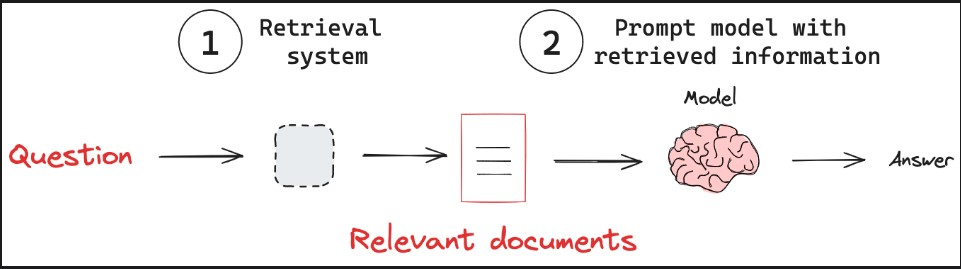

# Retrieval augmented generation (RAG)

## Overview

- It is a powerful technique that enhances language models by combining them with external knowledge bases.
- Rag addresses a Key limitation of models
  - Models rely on fixed training datasets
  - It can lead to outdated or incomplete information.
- With a given query, RAG systems first search a knowledge base for relevant information.
- The system then incorporates this retreived information into the model's prompt.
- The model uses the provided context to generate a response to the query.
- It bridges the gap between vast language models and dynamic, targeted information retrival.
- Rag is a powerful technique for building more capable and `reliable AI systems`.

## Key Concepts

